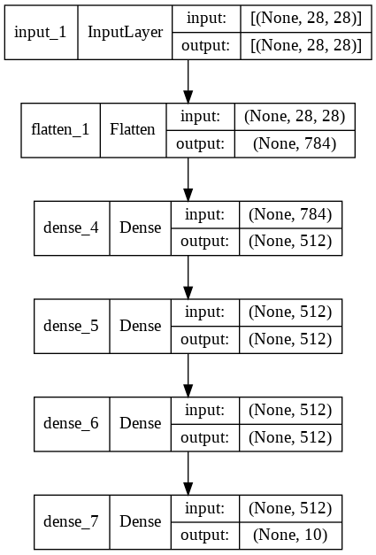

# Introduction

TensorFlow is an end-to-end open source platform for machine learning. It has a comprehensive, flexible ecosystem of tools, libraries and community resources that lets researchers push the state-of-the-art in ML and developers easily build and deploy ML powered applications.

This notebook Provides basic starting point and boiler plate code for Tensorflow 2.0 with respect Model creation and training. 

The approch followed is to create, train, evaluate Models with same architechture, same MNIST dataset using different ways of building Models from basic to advanced method and different ways of training at basic level. 

## Import Libraries

Below are some basic Libraries  related to Tensorflow and Keras 


```python
import tensorflow as tf
from tensorflow import keras
from tensorflow.keras import Model
from tensorflow.keras.layers import Input,Layer,Dense,Flatten
```

Below are Libraries for needed to manupulate and visualize 


```python
import numpy as np
import pandas as pd
import matplotlib.pyplot as plt
```

## MNIST dataset

The MNIST dataset has handwritten digits as image files. 
It has a training set of 60,000 examples, and a test set of 10,000 examples

## Import MNIST dataset

# Different ways of Building Model

Keras datasets library has the mnist dataset inbuilt


```python
mnist = tf.keras.datasets.mnist
```


```python
(x_train,y_train),(x_test,y_test)=mnist.load_data() 
```

## Sequential Model

A Sequential model is appropriate for a plain stack of layers where each layer has exactly one input tensor and one output tensor.


### Model Architecture 


```python
def create_model():
  model=tf.keras.models.Sequential([
  tf.keras.layers.Flatten(input_shape=(28,28)),
  Dense(units=512,activation=tf.nn.relu),
  Dense(units=512,activation=tf.nn.relu),
  Dense(units=512,activation=tf.nn.relu),
  Dense(units=10,activation=tf.nn.softmax)])
  return model
```

### Create Model


```python
model=create_model()

```

### Model Summary


```python
model.summary()
```

    Model: "sequential"
    _________________________________________________________________
     Layer (type)                Output Shape              Param #   
    =================================================================
     flatten (Flatten)           (None, 784)               0         
                                                                     
     dense (Dense)               (None, 512)               401920    
                                                                     
     dense_1 (Dense)             (None, 512)               262656    
                                                                     
     dense_2 (Dense)             (None, 512)               262656    
                                                                     
     dense_3 (Dense)             (None, 10)                5130      
                                                                     
    =================================================================
    Total params: 932,362
    Trainable params: 932,362
    Non-trainable params: 0
    _________________________________________________________________
    

### Visualize Model


```python
keras.utils.plot_model(model, show_shapes=True)
```


### Compile Model

Compile step is a key step that users Optimizer, Loss fuction and Metrics used for Back propagation. Please refer below high level insignt

The Loss Function is one of the important components of Neural Networks. Loss is nothing but a prediction error of Neural Net. And the method to calculate the loss is called Loss Function. In simple words, the Loss is used to calculate the gradients. And gradients are used to update the weights of the Neural Net.

Optimizers are algorithms or methods used to change the attributes of your neural network such as weights and learning rate in order to reduce the losses. Optimizers help to get results faster.

Metrics can be accuracy, loss etc to assess the performance of Trained model


```python
model.compile(optimizer=tf.keras.optimizers.Adam(learning_rate=0.001), metrics=['accuracy'],loss='sparse_categorical_crossentropy')

```

### Train Model

Trains the model for a fixed number of epochs. At each epoch the weights are adjusted through back probagation. 

We can see every epoc the sparse_categorical_crossentropy loss is reduced and the train accuracy is increased


```python
model.fit(x_train,y_train,epochs=15,batch_size=1024)
```

    Epoch 1/15
    59/59 [==============================] - 1s 3ms/step - loss: 8.4750 - accuracy: 0.7977
    Epoch 2/15
    59/59 [==============================] - 0s 3ms/step - loss: 0.3311 - accuracy: 0.9366
    Epoch 3/15
    59/59 [==============================] - 0s 3ms/step - loss: 0.1572 - accuracy: 0.9632
    Epoch 4/15
    59/59 [==============================] - 0s 3ms/step - loss: 0.0824 - accuracy: 0.9789
    Epoch 5/15
    59/59 [==============================] - 0s 3ms/step - loss: 0.0419 - accuracy: 0.9883
    Epoch 6/15
    59/59 [==============================] - 0s 3ms/step - loss: 0.0206 - accuracy: 0.9950
    Epoch 7/15
    59/59 [==============================] - 0s 3ms/step - loss: 0.0103 - accuracy: 0.9980
    Epoch 8/15
    59/59 [==============================] - 0s 3ms/step - loss: 0.0052 - accuracy: 0.9996
    Epoch 9/15
    59/59 [==============================] - 0s 3ms/step - loss: 0.0030 - accuracy: 0.9999
    Epoch 10/15
    59/59 [==============================] - 0s 3ms/step - loss: 0.0021 - accuracy: 0.9999
    Epoch 11/15
    59/59 [==============================] - 0s 3ms/step - loss: 0.0016 - accuracy: 1.0000
    Epoch 12/15
    59/59 [==============================] - 0s 3ms/step - loss: 0.0013 - accuracy: 1.0000
    Epoch 13/15
    59/59 [==============================] - 0s 3ms/step - loss: 0.0011 - accuracy: 1.0000
    Epoch 14/15
    59/59 [==============================] - 0s 3ms/step - loss: 9.3821e-04 - accuracy: 1.0000
    Epoch 15/15
    59/59 [==============================] - 0s 3ms/step - loss: 8.2369e-04 - accuracy: 1.0000
    


    <keras.callbacks.History at 0x7f89e01bcc50>


### Evaluate Model with Test data

Test data is used evaluate the performance of the model trained. 


```python
testaccuracy=model.evaluate(x_test,y_test)
print("The test accuracy is :", np.round(testaccuracy[1]*100,2),"%")
```

    313/313 [==============================] - 1s 2ms/step - loss: 0.2533 - accuracy: 0.9586
    The test accuracy is : 95.86 %
    

## Model built with Functional APIs

The Keras functional API is a way to create models that are more flexible than the tf.keras.Sequential API. The functional API can handle models with non-linear topology, shared layers, and even multiple inputs or outputs.

### Model Architecture


```python
def build_model_with_functional():
    
    # instantiate the input Tensor
    input_layer = tf.keras.Input(shape=(28, 28))
    
    # stack the layers using the syntax: new_layer()(previous_layer)
    flatten_layer = tf.keras.layers.Flatten()(input_layer)
    first_dense = tf.keras.layers.Dense(512, activation=tf.nn.relu)(flatten_layer)
    second_dense = tf.keras.layers.Dense(512, activation=tf.nn.relu)(first_dense)
    third_dense = tf.keras.layers.Dense(512, activation=tf.nn.relu)(second_dense)
    output_layer = tf.keras.layers.Dense(10, activation=tf.nn.softmax)(third_dense)
    
    # declare inputs and outputs
    func_model = Model(inputs=input_layer, outputs=output_layer)
    
    return func_model
```

### Create, Visualize, Train and evaluate the model
The same steps explained in sequential model is consolidated here as they are exactly same code


```python
model=build_model_with_functional()
model.compile(optimizer=tf.keras.optimizers.Adam(learning_rate=0.001), metrics=['accuracy'],loss='sparse_categorical_crossentropy')
model.fit(x_train,y_train,epochs=5,batch_size=1024)
testaccuracy=model.evaluate(x_test,y_test)
print("The test accuracy is :", np.round(testaccuracy[1]*100,2),"%")
```

    Epoch 1/5
    59/59 [==============================] - 1s 3ms/step - loss: 9.2116 - accuracy: 0.7801
    Epoch 2/5
    59/59 [==============================] - 0s 3ms/step - loss: 0.3370 - accuracy: 0.9315
    Epoch 3/5
    59/59 [==============================] - 0s 3ms/step - loss: 0.1733 - accuracy: 0.9567
    Epoch 4/5
    59/59 [==============================] - 0s 3ms/step - loss: 0.0960 - accuracy: 0.9736
    Epoch 5/5
    59/59 [==============================] - 0s 3ms/step - loss: 0.0526 - accuracy: 0.9858
    313/313 [==============================] - 1s 2ms/step - loss: 0.2185 - accuracy: 0.9515
    The test accuracy is : 95.15 %
    


```python
model.summary()
```

    Model: "model"
    _________________________________________________________________
     Layer (type)                Output Shape              Param #   
    =================================================================
     input_1 (InputLayer)        [(None, 28, 28)]          0         
                                                                     
     flatten_1 (Flatten)         (None, 784)               0         
                                                                     
     dense_4 (Dense)             (None, 512)               401920    
                                                                     
     dense_5 (Dense)             (None, 512)               262656    
                                                                     
     dense_6 (Dense)             (None, 512)               262656    
                                                                     
     dense_7 (Dense)             (None, 10)                5130      
                                                                     
    =================================================================
    Total params: 932,362
    Trainable params: 932,362
    Non-trainable params: 0
    _________________________________________________________________
    


```python
keras.utils.plot_model(model, show_shapes=True)
```





## Advanced Model Building Methods

This will be used for some advanced needs. Below are few of them. 

1) To build models with multiple inputs and a single output and vice versa.

2) To  share weights between layers in a model 

3) Custom Computations within layers

4) Custom gradient function to be used in back probagation


This section shows custom layer method alone. There are other types like custom Methods, custom gradients etc

### Custom Layer definition

Custom class is defined using the super class Layer class that we imported. 
Activation functions, weights are intialized in the build method
call funtion does the back probagation and updates the weights of the network


```python
class CustomDense(Layer):

    # add an activation parameter
    def __init__(self, units=32, activation=None):
        super(CustomDense, self).__init__()
        self.units = units
        
        # define the activation to get from the built-in activation layers in Keras
        self.activation = tf.keras.activations.get(activation)


    def build(self, input_shape):
        w_init = tf.random_normal_initializer()
        self.w = tf.Variable(name="kernel",
            initial_value=w_init(shape=(input_shape[-1], self.units),
                                 dtype='float32'),
            trainable=True)
        b_init = tf.zeros_initializer()
        self.b = tf.Variable(name="bias",
            initial_value=b_init(shape=(self.units,), dtype='float32'),
            trainable=True)
        super().build(input_shape)


    def call(self, inputs):
        
        # pass the computation to the activation layer
        return self.activation(tf.matmul(inputs, self.w) + self.b)
```

### Model Architecture


```python
def build_model_with_custom_layer():
  model=tf.keras.models.Sequential([
  tf.keras.layers.Flatten(input_shape=(28,28)),
  CustomDense(units=512,activation=tf.nn.relu),
  CustomDense(units=512,activation=tf.nn.relu),
  CustomDense(units=512,activation=tf.nn.relu),
  CustomDense(units=10,activation=tf.nn.softmax)])
  return model
```

### Create, Visualize, Train and evaluate the model
The same steps explained in sequential model is consolidated here as they are exactly same code


```python
model=build_model_with_custom_layer()
model.compile(optimizer=tf.keras.optimizers.Adam(learning_rate=0.001), metrics=['accuracy'],loss='sparse_categorical_crossentropy')
model.fit(x_train,y_train,epochs=5,batch_size=1024)
testaccuracy=model.evaluate(x_test,y_test)
print("The test accuracy is :", np.round(testaccuracy[1]*100,2),"%")
```

    Epoch 1/5
    59/59 [==============================] - 1s 3ms/step - loss: 6.9926 - accuracy: 0.8236
    Epoch 2/5
    59/59 [==============================] - 0s 3ms/step - loss: 0.3592 - accuracy: 0.9421
    Epoch 3/5
    59/59 [==============================] - 0s 3ms/step - loss: 0.1580 - accuracy: 0.9664
    Epoch 4/5
    59/59 [==============================] - 0s 3ms/step - loss: 0.0767 - accuracy: 0.9797
    Epoch 5/5
    59/59 [==============================] - 0s 3ms/step - loss: 0.0332 - accuracy: 0.9909
    313/313 [==============================] - 1s 2ms/step - loss: 0.2930 - accuracy: 0.9522
    The test accuracy is : 95.22 %
    


```python
model.summary()
```

    Model: "sequential_1"
    _________________________________________________________________
     Layer (type)                Output Shape              Param #   
    =================================================================
     flatten_2 (Flatten)         (None, 784)               0         
                                                                     
     custom_dense (CustomDense)  (None, 512)               401920    
                                                                     
     custom_dense_1 (CustomDense  (None, 512)              262656    
     )                                                               
                                                                     
     custom_dense_2 (CustomDense  (None, 512)              262656    
     )                                                               
                                                                     
     custom_dense_3 (CustomDense  (None, 10)               5130      
     )                                                               
                                                                     
    =================================================================
    Total params: 932,362
    Trainable params: 932,362
    Non-trainable params: 0
    _________________________________________________________________
    


```python
keras.utils.plot_model(model, show_shapes=True)
```


# Different ways of Training Model

Some of the basic methods of tracking metrics for training and validation and to prevent overfitting.

## Tracking Training metrics


```python
model=create_model()
model.compile(optimizer=tf.keras.optimizers.Adam(learning_rate=0.001), metrics=['accuracy'],loss='sparse_categorical_crossentropy')
model.fit(x_train,y_train,epochs=5,batch_size=1024)
testaccuracy=model.evaluate(x_test,y_test)
print("The test accuracy is :", np.round(testaccuracy[1]*100,2),"%")
```

    Epoch 1/5
    59/59 [==============================] - 1s 3ms/step - loss: 10.1107 - accuracy: 0.7674
    Epoch 2/5
    59/59 [==============================] - 0s 3ms/step - loss: 0.3363 - accuracy: 0.9260
    Epoch 3/5
    59/59 [==============================] - 0s 3ms/step - loss: 0.1724 - accuracy: 0.9547
    Epoch 4/5
    59/59 [==============================] - 0s 3ms/step - loss: 0.0966 - accuracy: 0.9730
    Epoch 5/5
    59/59 [==============================] - 0s 3ms/step - loss: 0.0556 - accuracy: 0.9842
    313/313 [==============================] - 1s 2ms/step - loss: 0.2094 - accuracy: 0.9520
    The test accuracy is : 95.2 %
    

## Tracking Training & Validation metrics

Validation split option given below make the training to calculate valition metrics that will be used for early stopping and overfitting. 

If we have validation data separately we can provide validaiton_data=[val_Data,val_labels] instead of validation split.


```python
model=create_model()
model.compile(optimizer=tf.keras.optimizers.Adam(learning_rate=0.001), metrics=['accuracy'],loss='sparse_categorical_crossentropy')
model.fit(x_train,y_train,epochs=50,batch_size=1024,validation_split=0.2)

```

    Epoch 1/50
    47/47 [==============================] - 1s 6ms/step - loss: 10.0500 - accuracy: 0.7710 - val_loss: 0.5356 - val_accuracy: 0.9170
    Epoch 2/50
    47/47 [==============================] - 0s 4ms/step - loss: 0.3576 - accuracy: 0.9307 - val_loss: 0.3286 - val_accuracy: 0.9343
    Epoch 3/50
    47/47 [==============================] - 0s 4ms/step - loss: 0.1703 - accuracy: 0.9579 - val_loss: 0.2686 - val_accuracy: 0.9443
    Epoch 4/50
    47/47 [==============================] - 0s 3ms/step - loss: 0.0894 - accuracy: 0.9761 - val_loss: 0.2526 - val_accuracy: 0.9456
    Epoch 5/50
    47/47 [==============================] - 0s 4ms/step - loss: 0.0485 - accuracy: 0.9865 - val_loss: 0.2398 - val_accuracy: 0.9493
    Epoch 6/50
    47/47 [==============================] - 0s 4ms/step - loss: 0.0244 - accuracy: 0.9941 - val_loss: 0.2354 - val_accuracy: 0.9517
    Epoch 7/50
    47/47 [==============================] - 0s 4ms/step - loss: 0.0127 - accuracy: 0.9975 - val_loss: 0.2292 - val_accuracy: 0.9555
    Epoch 8/50
    47/47 [==============================] - 0s 4ms/step - loss: 0.0065 - accuracy: 0.9994 - val_loss: 0.2286 - val_accuracy: 0.9555
    Epoch 9/50
    47/47 [==============================] - 0s 4ms/step - loss: 0.0037 - accuracy: 0.9999 - val_loss: 0.2287 - val_accuracy: 0.9561
    Epoch 10/50
    47/47 [==============================] - 0s 4ms/step - loss: 0.0026 - accuracy: 1.0000 - val_loss: 0.2291 - val_accuracy: 0.9568
    Epoch 11/50
    47/47 [==============================] - 0s 4ms/step - loss: 0.0021 - accuracy: 1.0000 - val_loss: 0.2285 - val_accuracy: 0.9572
    Epoch 12/50
    47/47 [==============================] - 0s 4ms/step - loss: 0.0017 - accuracy: 1.0000 - val_loss: 0.2282 - val_accuracy: 0.9578
    Epoch 13/50
    47/47 [==============================] - 0s 4ms/step - loss: 0.0014 - accuracy: 1.0000 - val_loss: 0.2296 - val_accuracy: 0.9582
    Epoch 14/50
    47/47 [==============================] - 0s 4ms/step - loss: 0.0012 - accuracy: 1.0000 - val_loss: 0.2291 - val_accuracy: 0.9579
    Epoch 15/50
    47/47 [==============================] - 0s 4ms/step - loss: 0.0011 - accuracy: 1.0000 - val_loss: 0.2295 - val_accuracy: 0.9584
    Epoch 16/50
    47/47 [==============================] - 0s 4ms/step - loss: 9.4969e-04 - accuracy: 1.0000 - val_loss: 0.2299 - val_accuracy: 0.9586
    Epoch 17/50
    47/47 [==============================] - 0s 4ms/step - loss: 8.5186e-04 - accuracy: 1.0000 - val_loss: 0.2299 - val_accuracy: 0.9588
    Epoch 18/50
    47/47 [==============================] - 0s 4ms/step - loss: 7.6219e-04 - accuracy: 1.0000 - val_loss: 0.2306 - val_accuracy: 0.9588
    Epoch 19/50
    47/47 [==============================] - 0s 4ms/step - loss: 6.8875e-04 - accuracy: 1.0000 - val_loss: 0.2305 - val_accuracy: 0.9591
    Epoch 20/50
    47/47 [==============================] - 0s 4ms/step - loss: 6.2304e-04 - accuracy: 1.0000 - val_loss: 0.2305 - val_accuracy: 0.9593
    Epoch 21/50
    47/47 [==============================] - 0s 3ms/step - loss: 5.7018e-04 - accuracy: 1.0000 - val_loss: 0.2307 - val_accuracy: 0.9598
    Epoch 22/50
    47/47 [==============================] - 0s 4ms/step - loss: 5.2338e-04 - accuracy: 1.0000 - val_loss: 0.2314 - val_accuracy: 0.9600
    Epoch 23/50
    47/47 [==============================] - 0s 4ms/step - loss: 4.8150e-04 - accuracy: 1.0000 - val_loss: 0.2315 - val_accuracy: 0.9602
    Epoch 24/50
    47/47 [==============================] - 0s 4ms/step - loss: 4.4403e-04 - accuracy: 1.0000 - val_loss: 0.2320 - val_accuracy: 0.9603
    Epoch 25/50
    47/47 [==============================] - 0s 4ms/step - loss: 4.1128e-04 - accuracy: 1.0000 - val_loss: 0.2321 - val_accuracy: 0.9603
    Epoch 26/50
    47/47 [==============================] - 0s 4ms/step - loss: 3.8172e-04 - accuracy: 1.0000 - val_loss: 0.2326 - val_accuracy: 0.9603
    Epoch 27/50
    47/47 [==============================] - 0s 4ms/step - loss: 3.5563e-04 - accuracy: 1.0000 - val_loss: 0.2328 - val_accuracy: 0.9602
    Epoch 28/50
    47/47 [==============================] - 0s 4ms/step - loss: 3.3193e-04 - accuracy: 1.0000 - val_loss: 0.2332 - val_accuracy: 0.9606
    Epoch 29/50
    47/47 [==============================] - 0s 4ms/step - loss: 3.0909e-04 - accuracy: 1.0000 - val_loss: 0.2336 - val_accuracy: 0.9607
    Epoch 30/50
    47/47 [==============================] - 0s 4ms/step - loss: 2.9048e-04 - accuracy: 1.0000 - val_loss: 0.2337 - val_accuracy: 0.9609
    Epoch 31/50
    47/47 [==============================] - 0s 4ms/step - loss: 2.7263e-04 - accuracy: 1.0000 - val_loss: 0.2338 - val_accuracy: 0.9607
    Epoch 32/50
    47/47 [==============================] - 0s 4ms/step - loss: 2.5543e-04 - accuracy: 1.0000 - val_loss: 0.2339 - val_accuracy: 0.9602
    Epoch 33/50
    47/47 [==============================] - 0s 4ms/step - loss: 2.4074e-04 - accuracy: 1.0000 - val_loss: 0.2346 - val_accuracy: 0.9610
    Epoch 34/50
    47/47 [==============================] - 0s 4ms/step - loss: 2.2690e-04 - accuracy: 1.0000 - val_loss: 0.2347 - val_accuracy: 0.9612
    Epoch 35/50
    47/47 [==============================] - 0s 4ms/step - loss: 2.1398e-04 - accuracy: 1.0000 - val_loss: 0.2350 - val_accuracy: 0.9612
    Epoch 36/50
    47/47 [==============================] - 0s 3ms/step - loss: 2.0227e-04 - accuracy: 1.0000 - val_loss: 0.2355 - val_accuracy: 0.9619
    Epoch 37/50
    47/47 [==============================] - 0s 4ms/step - loss: 1.9076e-04 - accuracy: 1.0000 - val_loss: 0.2354 - val_accuracy: 0.9613
    Epoch 38/50
    47/47 [==============================] - 0s 4ms/step - loss: 1.8179e-04 - accuracy: 1.0000 - val_loss: 0.2358 - val_accuracy: 0.9617
    Epoch 39/50
    47/47 [==============================] - 0s 4ms/step - loss: 1.7166e-04 - accuracy: 1.0000 - val_loss: 0.2361 - val_accuracy: 0.9618
    Epoch 40/50
    47/47 [==============================] - 0s 4ms/step - loss: 1.6309e-04 - accuracy: 1.0000 - val_loss: 0.2364 - val_accuracy: 0.9617
    Epoch 41/50
    47/47 [==============================] - 0s 4ms/step - loss: 1.5517e-04 - accuracy: 1.0000 - val_loss: 0.2367 - val_accuracy: 0.9619
    Epoch 42/50
    47/47 [==============================] - 0s 4ms/step - loss: 1.4714e-04 - accuracy: 1.0000 - val_loss: 0.2369 - val_accuracy: 0.9617
    Epoch 43/50
    47/47 [==============================] - 0s 4ms/step - loss: 1.4015e-04 - accuracy: 1.0000 - val_loss: 0.2373 - val_accuracy: 0.9617
    Epoch 44/50
    47/47 [==============================] - 0s 4ms/step - loss: 1.3339e-04 - accuracy: 1.0000 - val_loss: 0.2376 - val_accuracy: 0.9621
    Epoch 45/50
    47/47 [==============================] - 0s 4ms/step - loss: 1.2716e-04 - accuracy: 1.0000 - val_loss: 0.2376 - val_accuracy: 0.9618
    Epoch 46/50
    47/47 [==============================] - 0s 3ms/step - loss: 1.2131e-04 - accuracy: 1.0000 - val_loss: 0.2381 - val_accuracy: 0.9619
    Epoch 47/50
    47/47 [==============================] - 0s 4ms/step - loss: 1.1598e-04 - accuracy: 1.0000 - val_loss: 0.2382 - val_accuracy: 0.9622
    Epoch 48/50
    47/47 [==============================] - 0s 4ms/step - loss: 1.1079e-04 - accuracy: 1.0000 - val_loss: 0.2386 - val_accuracy: 0.9622
    Epoch 49/50
    47/47 [==============================] - 0s 4ms/step - loss: 1.0595e-04 - accuracy: 1.0000 - val_loss: 0.2389 - val_accuracy: 0.9623
    Epoch 50/50
    47/47 [==============================] - 0s 4ms/step - loss: 1.0133e-04 - accuracy: 1.0000 - val_loss: 0.2391 - val_accuracy: 0.9622
    


    <keras.callbacks.History at 0x7f8af3fbecd0>


### Ploting Train vs Test loss


```python

plt.figure(figsize=(10,8))
test_accuracy=model.history.history['val_accuracy']
train_accuracy=model.history.history['accuracy']
epochs_range=range(1,len(test_accuracy)+1)
plt.plot(epochs_range, test_accuracy,'b', linewidth=1,label='Test Accuracy')
plt.plot(epochs_range, train_accuracy,'r', linewidth=1,label='Train Accuracy')
plt.xlabel("Epoch")
plt.ylabel(" Validation accuracy")
plt.title("Model's Train vs Test accuracy ")
plt.legend()
plt.grid()
plt.show()
```


```python
testaccuracy=model.evaluate(x_test,y_test)
print("The test accuracy is :", np.round(testaccuracy[1]*100,2),"%")
```

    313/313 [==============================] - 1s 2ms/step - loss: 0.2527 - accuracy: 0.9617
    The test accuracy is : 96.17 %
    

## Early stopping to prevent Overfitting

Below code shows how to do early stopping to prevent overfitting.
This code check validation accuracy and if it does not increase for 2 epochs(patience), it stops the train and assigns best possible weights to the model(restore_best_weights=True) 


```python
from tensorflow.keras.callbacks import EarlyStopping, ModelCheckpoint
callbacks = [EarlyStopping(monitor='val_accuracy', patience=2,restore_best_weights=True)] # Early Stopping

model=create_model()
model.compile(optimizer=tf.keras.optimizers.Adam(learning_rate=0.001), metrics=['accuracy'],loss='sparse_categorical_crossentropy')
model.fit(x_train,y_train,epochs=50,batch_size=1024,validation_split=0.2,callbacks=callbacks)

```

    Epoch 1/50
    47/47 [==============================] - 1s 7ms/step - loss: 10.0079 - accuracy: 0.7644 - val_loss: 0.5353 - val_accuracy: 0.9054
    Epoch 2/50
    47/47 [==============================] - 0s 4ms/step - loss: 0.3624 - accuracy: 0.9224 - val_loss: 0.3240 - val_accuracy: 0.9300
    Epoch 3/50
    47/47 [==============================] - 0s 4ms/step - loss: 0.1776 - accuracy: 0.9545 - val_loss: 0.2734 - val_accuracy: 0.9358
    Epoch 4/50
    47/47 [==============================] - 0s 4ms/step - loss: 0.0989 - accuracy: 0.9733 - val_loss: 0.2493 - val_accuracy: 0.9415
    Epoch 5/50
    47/47 [==============================] - 0s 4ms/step - loss: 0.0562 - accuracy: 0.9852 - val_loss: 0.2348 - val_accuracy: 0.9466
    Epoch 6/50
    47/47 [==============================] - 0s 4ms/step - loss: 0.0312 - accuracy: 0.9924 - val_loss: 0.2280 - val_accuracy: 0.9473
    Epoch 7/50
    47/47 [==============================] - 0s 4ms/step - loss: 0.0177 - accuracy: 0.9966 - val_loss: 0.2263 - val_accuracy: 0.9498
    Epoch 8/50
    47/47 [==============================] - 0s 4ms/step - loss: 0.0103 - accuracy: 0.9987 - val_loss: 0.2226 - val_accuracy: 0.9511
    Epoch 9/50
    47/47 [==============================] - 0s 4ms/step - loss: 0.0062 - accuracy: 0.9995 - val_loss: 0.2219 - val_accuracy: 0.9512
    Epoch 10/50
    47/47 [==============================] - 0s 4ms/step - loss: 0.0041 - accuracy: 0.9999 - val_loss: 0.2223 - val_accuracy: 0.9523
    Epoch 11/50
    47/47 [==============================] - 0s 4ms/step - loss: 0.0030 - accuracy: 0.9999 - val_loss: 0.2224 - val_accuracy: 0.9533
    Epoch 12/50
    47/47 [==============================] - 0s 4ms/step - loss: 0.0023 - accuracy: 1.0000 - val_loss: 0.2228 - val_accuracy: 0.9540
    Epoch 13/50
    47/47 [==============================] - 0s 4ms/step - loss: 0.0018 - accuracy: 1.0000 - val_loss: 0.2236 - val_accuracy: 0.9543
    Epoch 14/50
    47/47 [==============================] - 0s 4ms/step - loss: 0.0015 - accuracy: 1.0000 - val_loss: 0.2238 - val_accuracy: 0.9548
    Epoch 15/50
    47/47 [==============================] - 0s 4ms/step - loss: 0.0013 - accuracy: 1.0000 - val_loss: 0.2252 - val_accuracy: 0.9553
    Epoch 16/50
    47/47 [==============================] - 0s 4ms/step - loss: 0.0011 - accuracy: 1.0000 - val_loss: 0.2252 - val_accuracy: 0.9555
    Epoch 17/50
    47/47 [==============================] - 0s 4ms/step - loss: 9.8145e-04 - accuracy: 1.0000 - val_loss: 0.2253 - val_accuracy: 0.9561
    Epoch 18/50
    47/47 [==============================] - 0s 4ms/step - loss: 8.6937e-04 - accuracy: 1.0000 - val_loss: 0.2263 - val_accuracy: 0.9560
    Epoch 19/50
    47/47 [==============================] - 0s 4ms/step - loss: 7.7791e-04 - accuracy: 1.0000 - val_loss: 0.2266 - val_accuracy: 0.9568
    Epoch 20/50
    47/47 [==============================] - 0s 4ms/step - loss: 6.9855e-04 - accuracy: 1.0000 - val_loss: 0.2270 - val_accuracy: 0.9571
    Epoch 21/50
    47/47 [==============================] - 0s 4ms/step - loss: 6.3121e-04 - accuracy: 1.0000 - val_loss: 0.2277 - val_accuracy: 0.9576
    Epoch 22/50
    47/47 [==============================] - 0s 4ms/step - loss: 5.7409e-04 - accuracy: 1.0000 - val_loss: 0.2278 - val_accuracy: 0.9576
    Epoch 23/50
    47/47 [==============================] - 0s 4ms/step - loss: 5.2390e-04 - accuracy: 1.0000 - val_loss: 0.2287 - val_accuracy: 0.9578
    Epoch 24/50
    47/47 [==============================] - 0s 4ms/step - loss: 4.8036e-04 - accuracy: 1.0000 - val_loss: 0.2289 - val_accuracy: 0.9582
    Epoch 25/50
    47/47 [==============================] - 0s 4ms/step - loss: 4.4246e-04 - accuracy: 1.0000 - val_loss: 0.2295 - val_accuracy: 0.9582
    Epoch 26/50
    47/47 [==============================] - 0s 4ms/step - loss: 4.0782e-04 - accuracy: 1.0000 - val_loss: 0.2298 - val_accuracy: 0.9588
    Epoch 27/50
    47/47 [==============================] - 0s 4ms/step - loss: 3.7818e-04 - accuracy: 1.0000 - val_loss: 0.2307 - val_accuracy: 0.9585
    Epoch 28/50
    47/47 [==============================] - 0s 4ms/step - loss: 3.4985e-04 - accuracy: 1.0000 - val_loss: 0.2308 - val_accuracy: 0.9588
    Epoch 29/50
    47/47 [==============================] - 0s 4ms/step - loss: 3.2579e-04 - accuracy: 1.0000 - val_loss: 0.2311 - val_accuracy: 0.9591
    Epoch 30/50
    47/47 [==============================] - 0s 4ms/step - loss: 3.0251e-04 - accuracy: 1.0000 - val_loss: 0.2319 - val_accuracy: 0.9588
    Epoch 31/50
    47/47 [==============================] - 0s 4ms/step - loss: 2.8250e-04 - accuracy: 1.0000 - val_loss: 0.2319 - val_accuracy: 0.9591
    


    <keras.callbacks.History at 0x7f89e00e8d90>


Here we can observe that though we ask the training step to do 50 epochs, it stops in fewer epochs as the validation accuracy has not increased more than 2 times. 

We can use other metrics like Validation loss, training loss, etc to decide when to stop training. 

### Ploting Train vs Test loss


```python

plt.figure(figsize=(10,8))
test_accuracy=model.history.history['val_accuracy']
train_accuracy=model.history.history['accuracy']
epochs_range=range(1,len(test_accuracy)+1)
plt.plot(epochs_range, test_accuracy,'b', linewidth=1,label='Test Accuracy')
plt.plot(epochs_range, train_accuracy,'r', linewidth=1,label='Train Accuracy')
plt.xlabel("Epoch")
plt.ylabel(" Validation accuracy")
plt.title("Model's Train vs Test accuracy ")
plt.legend()
plt.grid()
plt.show()
```


This is to show above early stoping obersvation graphically. 

# Summary

This notebook provides some starting point to anyone to start coding in tensorflow to build and train models. It also covers some basic tricks like early stopping, tracking  metrics etc 

Below reference can be checked to find different Optimizers, Loss fuctions, early stopping and other advanced techniques to build upon. 

## References

https://www.tensorflow.org/

https://keras.io/

https://www.coursera.org/


